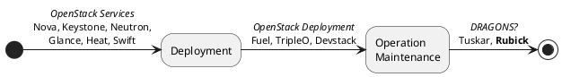

# Examples

<!-- markdown-toc start - Don't edit this section. Run M-x markdown-toc-refresh-toc -->
**Table of Contents**

- [Mermaid graph rendering](#mermaid-graph-rendering)
- [PlantUML graph rendering ](#plantuml-graph-rendering)
- [REST API Testing via `hurl`](#rest-api-testing-via-hurl)

<!-- markdown-toc end -->

# Emacs Lisp evaluation 

1. If you're reading this, you already have Emacs installed.
2. Start the Emacs server, so that `emacsclient` works.
3. Add a code block evaluator to your `config.json` (if your config file isn't empty, just copy the `"elist":{...}` part):

   ```json
    {
      "evaluators": {
        "codeBlock": {
          "elisp": {
            "path": "/usr/bin/env",
            "defaultArguments": ["emacsclient", "--eval"],
            "result": "codeBlock"
          }
        }
      }
    }
    ```

```elisp 
(concat "Hello, " "World!")
```


# Mermaid graph rendering

1. Install https://github.com/mermaid-js/mermaid-cli for the CLI tool and copy the path via `which mmdc`.
2. Add a code block evaluator to your `config.json` (if your config file isn't empty, just copy the `"mermaid":{...}` part):

    ```json
    {
      "evaluators": {
        "codeBlock": {
          "mermaid": {
            "path": "/path/to/mmdc",
            "defaultArguments": [
              "--input", "-",
              "--outputFormat", "svg",
              "--output", "-"
            ],
            "result": {
              "type": "image",
              "extension": "svg",
              "directory": "./images/",
              "filename": "yyyyMMddHHmmss'--$fn__$hash'"
            }
          }
        }
      }
    }
    ```

Afterwards, you can run `mermaid` code blocks, and get the rendered image inserted into the document:


# PlantUML graph rendering 

1. Install https://plantuml.com/ and copy the path via `which plantuml`.
2. Add a code block evaluator to your `config.json` (if your config file isn't empty, just copy the `"mermaid":{...}` part):
 
    ```json
    {
      "evaluators": {
        "codeBlock": {
          "plantuml": {
            "path": "/path/to/plantuml",
            "defaultArguments": [
              "-pipe",
              "-noerror",
              "-tsvg"
            ],
            "result": {
              "type": "image",
              "extension": "svg",
              "directory": "./images/",
              "filename": "yyyyMMddHHmmss'--$fn__$hash'"
            }
          }
        }
      }
    }
    ```

Afterwards, you can run `mermaid` code blocks, and get the rendered image inserted into the document. Example from <https://real-world-plantuml.com/>:




# REST API Testing via `hurl`

1. Install https://hurl.dev/ and copy the path via `which hurl`.
2. Add a code block evaluator to your `config.json` (if your config file isn't empty, just copy the `"hurl":{...}` part):

    ```json
    {
      "evaluators": {
        "codeBlock": {
          "hurl": {
            "path": "/path/to/hurl",
            "defaultArguments": [],
            "result": "codeBlock"
          }
        }
      }
    }
    ```

Afterwards, you can run `hurl` code blocks like [Hurl files](https://hurl.dev/docs/hurl-file.html) would:

```hurl
POST https://httpbin.org/post
Content-Type: application/json
{ "test":"foo","bar":"baz" }
```

<!--Result:-->
```
{
  "args": {}, 
  "data": "{ \"test\":\"foo\",\"bar\":\"baz\" }", 
  "files": {}, 
  "form": {}, 
  "headers": {
    "Accept": "*/*", 
    "Content-Length": "28", 
    "Content-Type": "application/json", 
    "Host": "httpbin.org", 
    "User-Agent": "hurl/6.1.1", 
    "X-Amzn-Trace-Id": "Root=1-680093bf-142169f93e6208ec096d1024"
  }, 
  "json": {
    "bar": "baz", 
    "test": "foo"
  }, 
  "origin": "79.221.187.120", 
  "url": "https://httpbin.org/post"
}
```


<!-- 
Local Variables:
markdown-toc-user-toc-structure-manipulation-fn: cdr
End:
-->
